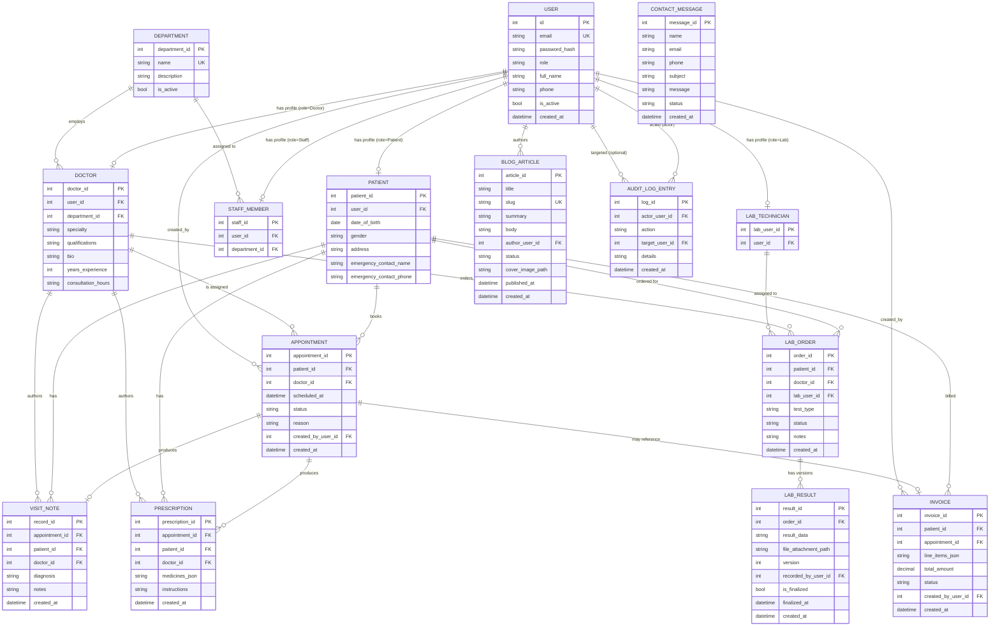

# Green Valley Hospital — System Architecture

Status: Draft v1.0
Owner: Solution Architect stage
Consumers: Backend developer agent, Frontend developer agent, QA agent
Source of truth for requirements: `docs/requirements.md`

---

## 1. System Overview

A single-instance web application with a Python backend API and a React single-page frontend, backed by SQLite.

```
┌─────────────────────────┐        HTTPS/JSON        ┌──────────────────────────────┐
│   React + Vite + TS      │  <───────────────────>  │        FastAPI backend        │
│   (SPA, React Router)    │        JWT bearer         │  (Python 3.11+, Uvicorn)     │
│                          │                            │                                │
│  - Public routes         │                            │  - SQLAlchemy ORM             │
│  - /admin/*  (guarded)   │                            │  - Pydantic v2 schemas        │
│  - /doctor/* (guarded)   │                            │  - python-jose (JWT)          │
│  - /patient/*(guarded)   │                            │  - passlib[bcrypt] (hashing)  │
│  - /staff/*  (guarded)   │                            │  - Alembic (migrations, opt.) │
│  - /lab/*    (guarded)   │                            │                                │
└─────────────────────────┘                            └───────────────┬───────────────┘
                                                                          │
                                                                          │ SQLAlchemy
                                                                          ▼
                                                          ┌──────────────────────────────┐
                                                          │   SQLite database file        │
                                                          │   db/hospital.db              │
                                                          └──────────────────────────────┘
                                                                          │
                                                          ┌──────────────────────────────┐
                                                          │  Local filesystem storage      │
                                                          │  /uploads/lab_results/*        │
                                                          │  /uploads/blog_covers/*        │
                                                          └──────────────────────────────┘
```

### 1.1 Backend
- **Framework**: FastAPI (Python 3.11+), served by Uvicorn.
- **ORM**: SQLAlchemy 2.x, models mapped 1:1 to the tables in `db/schema.sql`.
- **Validation / serialization**: Pydantic v2 schemas per endpoint (request + response models), field names in `snake_case` throughout (matches DB columns and JSON payloads — see §4).
- **Auth**: JWT bearer tokens issued on login, signed with a server-side secret (HS256) via `python-jose`. Passwords hashed with `passlib` using `bcrypt`.
- **Authorization**: implemented as FastAPI dependencies:
  - `get_current_user` — decodes/validates the JWT, loads the user, rejects with 401 if missing/expired/invalid.
  - `require_role(*roles)` — dependency factory that 403s if `current_user.role` isn't in the allowed set.
  - Row-level ownership checks (patient-owns-record, doctor-has-appointment-with-patient, lab-assigned-to-order) are performed inside each endpoint/service function against the DB — role membership alone never grants access to a specific row (per AUTHZ-6).
- **Migrations**: `db/schema.sql` is the canonical DDL for this build (SQLite, single file). Alembic may be introduced later; out of scope for this stage.
- **File storage**: local disk under `/uploads/`, subfolders `lab_results/` and `blog_covers/`. DB stores only the relative path (`file_attachment_path`, `cover_image_path`). Static files served through a backend route so lab-result attachments can be access-controlled (never mounted as an open static directory); blog cover images are mounted as public static files since they're already public content.

### 1.1.1 Batch 2 backend library additions (2026-07-20)

**WeasyPrint** (`weasyprint>=60.0`, OI-3 decision): Server-side PDF generation for REQ-08 (Patient Medical Record Export). Takes an HTML string rendered via Python string templates, converts to PDF using CSS `@page` rules and `position: fixed` for watermarks. Does not require a headless browser but requires system fonts (libpango/libcairo). On Windows dev environments, GTK+ runtime may be needed. See `src/backend/app/services/pdf_export.py` for the rendering service and `docs/delivery-plan.md` §4.2 R-1 for the Windows risk note.

**Poll-on-login notification pattern** (OI-2 decision): No background scheduler (APScheduler/Celery) added. Instead, `check_and_fire_deferred_notifications(db, user_id)` is called from the `get_current_user` FastAPI dependency on every authenticated request. This function:
1. Queries `notification_schedules` for unfired `appointment_reminder` rows where `trigger_at <= now` and the appointment belongs to the requesting user's patient profile.
2. Queries `satisfaction_surveys` for rows where `notification_sent=0`, `trigger_after <= now`, `expires_at > now`, `submitted_at IS NULL`, and `patient_id` matches.
3. Creates notifications and marks rows as fired/sent atomically.
Known limitation: notifications fire on next login, not at exact scheduled time. Acceptable for this build's scale.

### 1.2 Frontend
- **Framework**: React 19 + Vite + TypeScript.
- **Routing**: React Router v6, with a top-level split between public routes and role-guarded route trees:
  - `/` , `/about`, `/departments`, `/departments/:id`, `/doctors/:id`, `/contact`, `/blog`, `/blog/:slug`, `/login`, `/signup` — public.
  - `/admin/*` — Admin only.
  - `/doctor/*` — Doctor only.
  - `/patient/*` — Patient only.
  - `/staff/*` — Staff only.
  - `/lab/*` — Lab only.
- **Route guards**: a `<RequireAuth roles={[...]}>` wrapper reads the decoded JWT (role claim) from an auth context/store; unauthenticated users are redirected to `/login`, wrong-role users are redirected to a 403/"not authorized" page. This is a UX convenience only — the backend is the actual enforcement point (AUTHZ-6).
- **State/data fetching**: a thin API client (e.g. fetch wrapper or React Query) attaches the JWT as `Authorization: Bearer <token>` on every request to a protected endpoint.
- **Token storage**: JWT kept in memory + `localStorage` for session persistence across reloads (acceptable for this demo scope; no refresh-token rotation implemented — access token TTL is short, see §3).

### 1.2.1 Batch 2 frontend library additions (2026-07-20)

**Recharts** (`recharts ^2.12.0`, OI-4 decision): React-native SVG chart library for REQ-04 (Vitals Trend Visualization) and REQ-06 (Analytics Dashboard). Chosen over react-chartjs-2 (Canvas-based, harder accessibility) and Nivo (heavier d3 dependency). Produces accessible SVG output. Accessibility requirement VITFR-5: charts must use `strokeDasharray` dash patterns to distinguish series (not color alone), with ARIA labels on chart containers and Recharts `<Legend>` showing both color and dash-pattern symbols.

---

## 2. Entity-Relationship Diagram



Note: `LAB_RESULT` models amendment/versioning (LAB-4 / AC-LAB-3) as multiple rows per `order_id` (`version` incrementing, `is_finalized` flag) rather than in-place overwrite — see schema comments.

### Batch 2 ER additions (2026-07-20 — REQ-01 through REQ-12)

16 new tables added to `db/schema.sql` in the Batch 2 block. FK relationships below:

- `DOCTOR_AVAILABILITY_SCHEDULES` — FK to `DOCTOR` (doctor_id). One row per (doctor, day_of_week, start_time) time window. `UNIQUE (doctor_id, day_of_week, start_time)`.
- `DOCTOR_SLOT_CONFIGS` — FK to `DOCTOR` (doctor_id, UNIQUE). Stores slot_duration_minutes per doctor (default 30).
- `DOCTOR_AVAILABILITY_BLOCKS` — FK to `DOCTOR` (doctor_id). Date-specific overrides (full-day or time-range). NULL start_time/end_time = full-day block.
- `NOTIFICATIONS` — FK to `USER` (recipient_user_id). In-app notification inbox (separate from `email_notifications` which is the billing file-sink). Compound index on (recipient_user_id, is_read) for O(1) unread count.
- `NOTIFICATION_SCHEDULES` — FK to `APPOINTMENT` (appointment_id); soft FK to `SATISFACTION_SURVEYS` (survey_id). Deferred notification triggers for poll-on-login pattern.
- `INTAKE_FORMS` — FK to `APPOINTMENT` (UNIQUE) and `PATIENT`. Auto-created on appointment booking. 1:1 with appointments.
- `VITALS` — FK to `PATIENT`, `APPOINTMENT` (nullable), `USER` (recorded_by_user_id). Resolves pre-existing STF-4 schema gap.
- `REFERRALS` — FK to `DOCTOR` (referring_doctor_id, receiving_doctor_id), `DEPARTMENT` (receiving_department_id), `PATIENT`, `APPOINTMENT` (referred_appointment_id, nullable). Status: Pending → Accepted/Declined → AppointmentBooked → Completed.
- `DEPARTMENT_SYMPTOM_TAGS` — FK to `DEPARTMENT`. Up to 50 tags per department for public search enrichment. Case-insensitive uniqueness enforced at app layer.
- `WAITLIST_ENTRIES` — FK to `PATIENT`, `DOCTOR`. Per-doctor-per-date (OI-12). `held_slot_time` records which HH:MM slot is reserved for a 'Notified' entry.
- `SYSTEM_CONFIG` — Key-value store. Initial row: `waitlist_confirmation_hours = 4`.
- `DISCHARGE_SUMMARIES` — FK to `APPOINTMENT` (UNIQUE, ON DELETE RESTRICT), `PATIENT`, `DOCTOR`, `APPOINTMENT` (follow_up_appointment_id, nullable). 1:1 with completed appointments. Immutable after creation.
- `SATISFACTION_SURVEYS` — FK to `APPOINTMENT` (UNIQUE, ON DELETE RESTRICT), `PATIENT`, `DOCTOR`. 1:1 with completed appointments. `notification_sent` flag for poll-on-login.
- `CORPORATE_PACKAGES` — Standalone B2B package tiers. Soft delete via `is_active`.
- `CORPORATE_INQUIRIES` — FK to `CORPORATE_PACKAGES` (package_id, nullable ON DELETE SET NULL). Pipeline CRM rows.

Column addition to existing table:
- `INVOICE.paid_at TEXT` — set server-side when status transitions to 'Paid'. Used by analytics revenue 'collected' series (OI-7). Index: `idx_invoices_paid_at`.

---

## 3. Auth Flow

1. **Login**: `POST /auth/login` with `email` + `password`. Backend looks up the user by email, verifies the bcrypt hash, and checks `is_active`.
   - Wrong email or wrong password → `401 Unauthorized` with a generic `"Invalid email or password"` message (AUTH-5 — never reveals which field was wrong or whether the account exists).
   - Correct credentials but `is_active = false` → `403 Forbidden`, `{"detail": "Account is inactive"}` (AUTH-6).
   - Success → backend issues a JWT access token, HS256-signed, containing claims: `sub` (user id), `role`, `email`, `iat`, `exp`. Default TTL: **60 minutes**. No refresh token in this build (out of scope for demo); the frontend prompts re-login on expiry.
2. **Storing the token**: the frontend stores the JWT (memory + `localStorage`) and decodes the `role` claim client-side purely to drive route guards / UI (never trusted as the authorization boundary).
3. **Authenticated requests**: every protected request sends `Authorization: Bearer <token>`. FastAPI's `get_current_user` dependency decodes and validates the token (signature + expiry); missing/expired/malformed tokens → `401 Unauthorized` (AUTH-4).
4. **Authorization**: `require_role(...)` dependency checks the role claim against the endpoint's allowed roles → `403 Forbidden` if the role isn't permitted. Endpoints that expose a specific resource additionally re-check row-level ownership in the service layer (e.g. "does this appointment's `patient_id` match the current user's linked `patient_id`?") before returning data → `403 Forbidden` on mismatch (see §4.2 for the chosen 403 policy).
5. **Signup**: `POST /auth/signup` is public and unconditionally forces `role = "Patient"` server-side regardless of any role value in the payload (AC-AUTH-1) — the request schema for signup has no `role` field at all, closing that injection path entirely rather than relying on override logic.
6. **Logout**: stateless — the frontend simply discards the token. No server-side token blacklist in this build (acceptable given the short 60-minute TTL and out-of-scope status of advanced session management).

---

## 4. Resolved Open Items (from `docs/requirements.md` §5)

### 4.1 Appointment cancellation notice window (PAT-4 / AC-APT-3)
**Decision: 2 hours.** A patient may cancel their own `Scheduled` appointment via `DELETE /patients/me/appointments/{appointment_id}` (or status-update endpoint) only while `scheduled_at - now() >= 2 hours`. Inside the window, the backend rejects with `409 Conflict` and an explanatory message (`"Appointments can only be cancelled at least 2 hours before the scheduled time"`); the appointment status is left unchanged. Two hours (rather than the requirements doc's placeholder of one) gives front-desk/doctor staff a realistic window to fill or adjust the slot, while still letting patients cancel same-day for anything beyond the near-term. Staff/Admin are **not** subject to this window when cancelling on a patient's behalf (STF-1), since front-desk rescheduling is an operational override, not a self-service action.

### 4.2 403 vs 404 for cross-ownership access (AUTHZ-1)
**Decision: keep 403 Forbidden**, as the requirements doc's default. Rationale: this system's roles (Patient/Doctor/Staff/Lab/Admin) already know which resource types exist and, for the Doctor/Staff/Lab roles in particular, routinely need to distinguish "this record doesn't exist" from "you're not allowed to see it" for legitimate workflow reasons (e.g., a doctor debugging why a referenced patient ID isn't loading). Existence-privacy (404-for-everything) matters more for anonymous/public-facing enumeration attacks, which this system doesn't expose — all clinical endpoints already require authentication, so the marginal privacy gain of 404 is small next to the debuggability cost. This is applied uniformly: every endpoint that checks row-level ownership and fails returns `403 Forbidden`, never `404`, for an existing-but-not-owned resource ID. A `404 Not Found` is reserved strictly for IDs that do not exist in the table at all (checked after the ownership check would otherwise apply, so a well-formed-but-nonexistent ID from a non-owner still surfaces as 403 first if role/relationship isn't established, and 404 only for genuinely absent rows once ownership/role would have permitted access).

### 4.3 File storage mechanism for lab result attachments and blog images
**Decision: local filesystem**, confirming the requirements doc's assumption (Out of Scope §4 already excludes cloud CDN/virus scanning). Layout:
- `/uploads/lab_results/{order_id}/{result_id}_{filename}` — written by `POST /lab/orders/{order_id}/results`; the DB's `lab_results.file_attachment_path` stores the relative path. Served only via an authenticated backend route (`GET /lab/results/{result_id}/file`) that re-runs the same ownership checks as reading the result record itself (Doctor-with-appointment, owning Patient, Lab, or Admin) — never mounted as an open static directory, since these are clinical attachments.
- `/uploads/blog_covers/{article_id}_{filename}` — written by `POST /admin/blog` or `PUT /admin/blog/{id}`; `blog_articles.cover_image_path` stores the relative path. Mounted as a public static directory (`/static/blog_covers/...`) since blog cover images are already public content once an article is published (drafts' cover images are not linked from any public response body, so they aren't discoverable pre-publish even though the file technically exists on disk).
- Max upload size: 10 MB per file, enforced server-side; accepted types for lab attachments: PDF, JPEG, PNG; for blog covers: JPEG, PNG, WebP.

---

## 5. Field Naming Convention

All JSON request/response fields and all SQL columns use **snake_case**, matching 1:1 where a field is a direct pass-through of a DB column (e.g. `patient_id`, `scheduled_at`, `is_active`). This convention is used consistently across `db/schema.sql` and `docs/api-spec.md` — no endpoint introduces camelCase or abbreviated aliases (e.g. never `pid` for `patient_id`). The frontend is responsible for any camelCase conversion it wants internally in TypeScript; the wire format stays snake_case.
